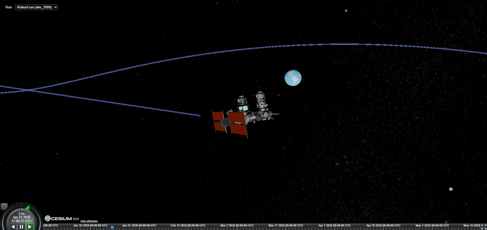

# Autonomous Station-Keeping in the CR3BP Using Physics-Based Dynamics, Reinforcement Learning, and Physics-Informed Neural Networks (Earth–Moon L1)



## Simulation & Reinforcement Learning (Robust Demo)

This project implements a simulation and reinforcement-learning framework for spacecraft **station-keeping** in the **Circular Restricted Three-Body Problem (CR3BP)**, with a focus on the **Earth–Moon L1** region.

The RL agent learns to maintain a spacecraft trajectory near L1 by **tracking a reference Halo-like orbit** (or optionally L1 directly) while minimizing control effort ($\Delta v$).

## Prior work & theoretical background

The CR3BP simulation core used in this project builds on my **prior work**.

The earlier project focuses on:
- The classical **N-body problem**
- Reduction to the **Circular Restricted Three-Body Problem (CR3BP)**
- Normalized units and rotating reference frames
- Numerical integration and trajectory analysis

### References to the original work

- **Python implementation (simulation core)** https://drive.google.com/file/d/1Zi63k1PvAzIcmbct0qGah_rrn2H0V0Z9/view

- **Analysis notebook (Colab)** https://colab.research.google.com/drive/1wJoJphKMbrssbXftERkunHfOmCUldQmI

- **Theoretical documentation (PDF)** https://drive.google.com/file/d/1zC02uh_ogOFGItnihVp9mOp915VS62ts/view

The current project extends this foundation by:
- Embedding the CR3BP dynamics into **Gymnasium-compatible RL environments**
- Introducing **reference-orbit tracking** (Halo orbits)
- Adding **deterministic and robust RL training setups**
- Preparing the system for **physics-informed learning (HNN)** in later stages

> **Note on theoretical documentation** > The classical CR3BP theory used in this project (problem formulation, normalized units, rotating reference frame, numerical integration, and basic stability considerations) is already covered in the referenced prior documentation.  
>  
> Ongoing and future theoretical work focuses on **Hamiltonian formulations**, **Hamiltonian Neural Networks (HNNs)**, and the **theoretical foundations of learning dynamics and control via RL**, which will be developed and maintained as a separate **Sphinx documentation**.

---

> **Note on execution environment** > The data pipeline (Airflow, Postgres, infrastructure services) is executed via **Docker**.  
> Reinforcement Learning (RL) and Hamiltonian Neural Network (HNN) training are run **locally** and **not inside Docker**.  
>  
> Before running RL or HNN training scripts, install the required Python dependencies:
> ```bash
> pip install -r requirements.txt
> ```

---

## Scope of this README section

This is **Part 1** of the project documentation and covers:

- CR3BP simulation setup
- Reinforcement Learning environments
- Robust RL demo configuration

---

## Key components (Simulation & RL)

### Environments
* `sim_rl/cr3bp/env_cr3bp_station_keeping.py`  
  Early baseline: L1 point tracking.

* `sim_rl/cr3bp/env_cr3bp_station_keeping_repo.py`  
  Deterministic variant with fixed scaling and reproducible behavior.

* `sim_rl/cr3bp/env_cr3bp_station_keeping_robust.py`  
  **Robust demo environment** with built-in physical uncertainties, including  
  domain randomization ($\mu$ perturbation), actuator noise, and external disturbance forces.

### Training scripts
* `sim_rl/training/train_poc.py`  
  Initial proof-of-concept training script.

* `sim_rl/training/train_poc_repo.py`  
  Deterministic training setup (fixed seeds, scaling).

* `sim_rl/training/train_poc_robust.py`  
  **Main demo training script** for robust RL, using the stochastic CR3BP environment
  with strict reproducibility (fixed seeds, CPU-only execution).

### Core physics
* `sim_rl/cr3bp/N_Body/nbody_lib.py`  
  Physics and numerical integration backend (from prior N-body work).

---

## Robust environment (Demo)

The robust environment preserves the same **reward structure** as the deterministic version
(quadratic position penalty, linear velocity and control penalties) while introducing
realistic uncertainties.

### Robustness mechanisms
1. **Domain randomization** The CR3BP mass parameter $\mu$ is perturbed at the start of each episode.

2. **Actuator noise** Control actions are affected by magnitude and direction noise.

3. **External disturbances** A constant disturbance acceleration (e.g. SRP-like bias) is applied per episode.

### Observation and action
- **Observation**: scaled relative state  
  [$\Delta$ position, $\Delta$ velocity] with deterministic scaling.
- **Action**: continuous thrust command in $[-1, 1]$, mapped to a small $\Delta v$.

### Reward structure
- **Position error**: quadratic penalty (stability).
- **Relative velocity**: linear penalty (damping).
- **Control effort ($\Delta v$)**: linear penalty (fuel efficiency / sparsity).
- **Crash near primaries**: episode termination with a hard penalty.

---

## Numerical integration

For this RL setup, the environment uses the **RK45** integrator.

---

## Running the RL demo

From the project root:

```bash
python -m sim_rl.training.train_poc_robust
```

This trains a PPO agent (Stable-Baselines3) on the robust CR3BP environment and writes outputs to:

```text
sim_rl/training/runs_robust/<scenario>/run_<timestamp>/
├── models/    # checkpoints and final model
├── logs/      # training & evaluation logs (incl. TensorBoard)
├── rollouts/  # selected rollout CSV exports
└── config/    # saved run configuration
```

### Pretrained / demo run
A reference demo run (weights and logs) is available at:

```text
sim_rl/training/runs_robust/earth-moon-L1-3D/run_20251209_114916
```

### Scenarios (Earth–Moon L1 by default)
Scenarios are defined in:
`sim_rl/cr3bp/scenarios.py`

Current default demo scenario:
* `earth-moon-L1-3D`: Earth–Moon system, L1, full 3D state and control.

New scenarios (different systems, Lagrange points, dimensionality, noise levels)
can be added by extending the `SCENARIOS` dictionary.

System parameters, normalization constants, reward weights and limits are defined in:
`sim_rl/cr3bp/constants.py`

---

## Data Pipeline (ELT for HNN Training)

The data pipeline is designed to generate **physics-only CR3BP trajectories**, store them
in a **normalized PostgreSQL schema**, and expose them through a **training-friendly SQL view**
used by Hamiltonian Neural Networks (HNNs).

The pipeline follows a clear **ELT pattern**:
**Extract → Load → Transform (View)**.

---

### Overview

**Purpose**
- Generate large-scale CR3BP trajectory datasets without control input.
- Persist raw physics data in a relational database.
- Provide a stable interface (`hnn_training_view`) for HNN training and analysis.

**Technologies**
- **Docker** (Infrastructure)
- **Apache Airflow** (Orchestration)
- **PostgreSQL** (Storage)
- **Pandas / NumPy** (Export & Ingestion)

---

### Infrastructure (Docker)

The pipeline infrastructure is started via Docker Compose:

```bash
cd deploy
docker compose up -d --build
```

This starts:
* **Postgres** (`cr3bp_db`)
* **Airflow** (Scheduler + Webserver)
* **pgAdmin** (Optional DB GUI)

Environment variables are provided via `.env` (a template is included as `deploy/.env.example`).

---

### Airflow DAG

* **DAG ID:** `cr3bp_daily_pipeline`
* **Location:** `/opt/airflow/data_pipeline/dags`
* **Schedule:** `@hourly` (manual triggering supported)

The DAG consists of two sequential tasks:

1.  **Generate trajectories**
    * Calls the batch exporter.
    * Writes raw CSV files to: `data_pipeline/raw_exports/`
2.  **Load CSVs into PostgreSQL**
    * Parses metadata from filenames.
    * Inserts run metadata and time-series samples into the database.

> Trigger manually via the Airflow UI (http://localhost:8080) if desired.

---

### Trajectory Types (Extract)

The batch exporter generates three physics-only trajectory families (no control actions, zero thrust),
using a high-order **DOP853 integrator** for improved numerical accuracy, which is particularly
important for stable and consistent **HNN training datasets**.
For future extensions, the pipeline is designed to support **symplectic integrators**, which are
well-suited for long-term Hamiltonian dynamics and energy-preserving trajectory generation.

* **L1 cloud trajectories** (`l1_cloud`)
    Small perturbations around the L1 region.
    **Constraint:** Simulation terminates if distance from L1 > 0.5 to prevent the HNN from learning divergent behavior far from the equilibrium.

* **Halo-seed cloud trajectories** (`halo_seed`)
    3D initial conditions with out-of-plane variation.
    **Constraint:** Simulation terminates if distance from L1 > 0.5.

* **Halo-reference trajectories** (`halo_ref_v1`)
    Propagation along a precomputed halo orbit (Reference-orbit mode: `use_reference_orbit=True`).

Each trajectory is exported as a single CSV file. The termination reason (e.g., `max_steps`, `escape`, `crash_primary1`) is encoded directly in the filename.

---

### Database Schema (Load)

All database objects live inside the `cr3bp` schema.

**Core tables:**
- `cr3bp_system`
- `cr3bp_lagrange_point`
- `cr3bp_simulation_run` (One row per CSV trajectory)
- `cr3bp_trajectory_sample` (Per-step time series)

Each **trajectory sample** stores:
- Time
- Position (`x`, `y`, `z`)
- Velocity (`vx`, `vy`, `vz`)
- Acceleration (`ax`, `ay`, `az`)

---

### HNN Training View (Transform)

After loading, a SQL view is created manually to flatten the data:

* **View name:** `cr3bp.hnn_training_view`
* **Definition:** `data_pipeline/transform/hnn_training_view.sql`

The view joins **simulation metadata**, **system/Lagrange point identifiers**, and **ordered trajectory samples**. This provides a flat dataset suitable for direct consumption by HNN dataloaders.

> **Note:** The view is currently created manually (copy & paste SQL).

---

## Hamiltonian Neural Network (HNN)

This chapter describes the **Hamiltonian Neural Network (HNN)** component of the project.
At this stage, the HNN is developed **independently of Reinforcement Learning** and focuses
exclusively on **learning the underlying CR3BP dynamics** from physics-generated data.

The HNN module is designed as a **physics-informed surrogate model** that learns a scalar
Hamiltonian and recovers time evolution via Hamilton’s equations.

---

### Conceptual Overview

The HNN learns a **scalar Hamiltonian** $H(q, p)$ from which time derivatives are obtained via **Hamilton’s equations**:

$$
\dot{q} = \frac{\partial H}{\partial p}, \qquad \dot{p} = -\frac{\partial H}{\partial q}
$$

Key design principles:
- The network **does not learn accelerations directly**.
- All dynamics are enforced implicitly through the **Hamiltonian structure**.
- Time derivatives are computed via **automatic differentiation**, ensuring consistency
  with the learned energy function.

This formulation is particularly suitable for long-term dynamical systems such as CR3BP,
where preserving physical structure is more important than short-horizon accuracy.

---

### State Representation and Canonical Momenta

The HNN operates in **canonical coordinates** $(q, p)$, not raw position–velocity space.

For the **rotating CR3BP frame (normalized units)**, the canonical momenta are defined as:

$$
\begin{aligned}
p_x &= v_x - y, \\
p_y &= v_y + x, \\
p_z &= v_z \quad (\text{for 3D}),
\end{aligned}
$$

with corresponding time derivatives:

$$
\begin{aligned}
\dot{p}_x &= a_x - v_y, \\
\dot{p}_y &= a_y + v_x, \\
\dot{p}_z &= a_z.
\end{aligned}
$$

This transformation embeds Coriolis effects directly into the momentum variables and allows
the Hamiltonian to represent the CR3BP dynamics in a physically meaningful form.

---

### Model Architecture

**File:** `hnn_models/model/hnn.py`

- Input: concatenated state $[q, p] \in \mathbb{R}^{2d}$
- Output: scalar Hamiltonian $H(q,p)$
- Architecture: fully connected MLP
- Activation: **sine (SIREN-style)** by default
- Hidden layers: configurable (default: 3 × 256)

The model stores **feature-wise normalization statistics** (`state_mean`, `state_std`)
as registered buffers, ensuring consistent scaling during training and inference.

Time derivatives are computed via:
- forward pass to obtain $H$
- automatic differentiation with respect to $q$ and $p$

---

### Training Dataset and Data Interface

**File:** `hnn_models/dataloader/hnn_dataset.py`

Training data is read directly from the PostgreSQL view:
```text
cr3bp.hnn_training_view
```

Each dataset sample corresponds to **one simulation time step** and provides:
- position $q$
- canonical momentum $p$
- ground-truth $\dot{q}$
- ground-truth $\dot{p}$

Key characteristics:
- Data originates from **physics-only CR3BP simulations**
- No control inputs are present
- Accelerations are taken directly from the simulator output
- Dataset-level normalization is computed over the concatenated state $[q,p]$

Optional SQL filtering (`WHERE` clause) and hard sample limits allow controlled experiments
(e.g. subset selection, phase-specific training).

---

### Training Procedure

**File:** `hnn_models/training/train_hnn.py`

The training objective minimizes a **combined MSE loss** on predicted time derivatives:

$$
\mathcal{L} = \text{MSE}(\dot{q}_{\text{pred}}, \dot{q}_{\text{true}}) + \text{MSE}(\dot{p}_{\text{pred}}, \dot{p}_{\text{true}})
$$

To stabilize optimization across different regions of state space:
- Each term is **scaled by its batch RMS magnitude**
- Gradients are clipped to prevent instability

Normalization strategy (priority order):
1. Forced normalization from an external `meta.json`
2. Reuse normalization from a loaded checkpoint
3. Fresh computation from the current dataset

Artifacts written during training:
- Best model checkpoint (`.pt`)
- Metadata file (`_meta.json`) containing normalization statistics and configuration

---

### Integration and Rollouts

**File:** `hnn_models/utilities/integration.py`

The HNN supports **rollouts via Hamiltonian time derivatives** using a
**Leapfrog-style integrator** (symplectic integrator family).

Key features:
- Safe handling of autograd graphs during multi-step rollouts
- Explicit separation between derivative computation and integration
- Designed for stability during long-horizon simulations

> **Integrator note** > The current implementation uses a Leapfrog-style scheme, which belongs to the
> symplectic integrator family and is well-suited for Hamiltonian systems.
>  
> Support for additional symplectic methods (e.g. Leapfrog for separable Hamiltonians
> or implicit midpoint schemes for general Hamiltonians) is planned for long-horizon
> stability studies.

---

### Evaluation and Analysis

Quantitative evaluation and qualitative analysis of HNN behavior
(e.g. rollout stability, trajectory comparison, error growth)
are currently performed in:

`notebooks/hnn_analysis.ipynb`

### Multi-Stage HNN Training Strategy

The final HNN model is obtained through a **three-stage training procedure**.
Each stage progressively refines the learned Hamiltonian, from global CR3BP dynamics
towards locally accurate and orbit-specific behavior near **Earth–Moon L1**.

All training runs use the same network architecture and differ only in
**data selection**, **learning rate**, and **initialization**.

---

#### Phase 1 – Global mixed dynamics pretraining

**Purpose:**
Learn a globally consistent Hamiltonian over a broad region of the state space,
while filtering out extreme accelerations.

* **Dataset:** mixed CR3BP trajectories (L1 cloud + halo seed + halo reference)
* **Filtering:** moderate acceleration bounds
* **Role:** establish a stable global energy landscape

```bash
python -m hnn_models.training.train_hnn \
  --dim 3 \
  --hidden-dims 256 256 256 \
  --batch-size 1024 \
  --epochs 50 \
  --lr 2e-4 \
  --limit 1000000 \
  --where-clause "abs(ax) < 15.0 AND abs(ay) < 15.0 AND abs(az) < 15.0" \
  --run-name hnn_cr3bp_l1_mixed_v3
```

---

#### Phase 2 – Local refinement around L1

**Purpose:**
Improve accuracy in the local neighborhood of the L1 equilibrium.

* **Dataset:** spatially restricted samples near L1
* **Initialization:** weights from Phase 1
* **Normalization:** reused from Phase 1 to ensure consistency
* **Role:** sharpen local dynamics without altering global scaling

```bash
python -m hnn_models.training.train_hnn \
  --dim 3 \
  --hidden-dims 256 256 256 \
  --batch-size 1024 \
  --epochs 30 \
  --lr 5e-5 \
  --limit 400000 \
  --where-clause "sqrt(power(x - 0.8368929, 2) + power(y, 2) + power(z, 2)) < 0.1" \
  --run-name hnn_cr3bp_l1_local_v3 \
  --load-checkpoint hnn_models/checkpoints/hnn_cr3bp_l1_mixed_v3.pt \
  --norm-source-meta hnn_models/checkpoints/hnn_cr3bp_l1_mixed_v3_meta.json
```

---

#### Phase 3 – Halo-orbit fine-tuning

**Purpose:**
Specialize the Hamiltonian for halo-reference trajectories relevant to
station-keeping and long-term orbit tracking.

* **Dataset:** halo-reference runs only
* **Spatial focus:** extended neighborhood around L1
* **Initialization:** Phase 2 checkpoint
* **Normalization:** still fixed to Phase 1 statistics
* **Role:** align learned dynamics with physically relevant halo motion

```bash
python -m hnn_models.training.train_hnn \
  --dim 3 \
  --hidden-dims 256 256 256 \
  --batch-size 1024 \
  --epochs 30 \
  --lr 1e-5 \
  --limit 400000 \
  --where-clause "initial_condition_type = 'halo_ref_v1_max' AND termination_reason = 'steps' AND sqrt(power(x - 0.8368929, 2) + power(y, 2) + power(z, 2)) < 0.25" \
  --run-name hnn_cr3bp_l1_halo_finetune_v3 \
  --load-checkpoint hnn_models/checkpoints/hnn_cr3bp_l1_local_v3.pt \
  --norm-source-meta hnn_models/checkpoints/hnn_cr3bp_l1_mixed_v3_meta.json
```

---

### Final checkpoints

All trained weights and corresponding metadata files are stored in:
`hnn_models/checkpoints/`

The final model (`hnn_cr3bp_l1_halo_finetune_v3.pt`) represents a **globally consistent, locally refined, and orbit-specialized Hamiltonian** learned from CR3BP trajectory data.

In standalone HNN rollouts, stable trajectory propagation was observed for approximately the first **700 integration steps** at a step size of **dt = 0.01**. Beyond this horizon, accumulated modeling and numerical integration errors become noticeable, which is expected for learned Hamiltonian dynamics.

When embedded into reinforcement learning experiments, the learned HNN-based dynamics remained fully operational but required a reduced episode length (`max_steps` reduced from **1200 to ~700**) and resulted in a **higher control effort ($\Delta v$ consumption)** compared to the pure physics-based environment.

Importantly, this reduced training horizon reflects a **practical RL stability and efficiency choice**, rather than a hard limitation of the HNN itself. After training, the HNN-based controller can be executed in **longer closed-loop simulations** without numerical instability. Station-keeping performance and halo-tracking error remain bounded over extended time spans, as confirmed by post-training rollout evaluations.

---

## Hybrid RL with HNN Dynamics (Robust Demo)

This section describes the **HNN-accelerated robust RL setup**, which differs from the
pure physics-based RL environments above.

Instead of propagating the CR3BP state with a numerical ODE integrator (e.g. RK45),
this variant uses a **trained Hamiltonian Neural Network (HNN)** as a dynamics surrogate
and performs the time update in **canonical coordinates (q, p)**.

At the same time, it preserves the **robustness mechanisms** (domain randomization,
actuator noise, disturbance acceleration) used in the robust physics-based demo.

---

### Key difference vs. physics-based RL

**Physics-based RL (above):**
* Next state is computed by integrating the CR3BP equations of motion with an ODE solver.
* Numerical accuracy is controlled by the integrator configuration.

**HNN-accelerated robust RL (this section):**
* Next state is computed by:
  1. transforming the physical state (position/velocity) into canonical coordinates (q, p),
  2. evaluating Hamilton’s equations via autograd on the learned Hamiltonian,
  3. integrating the learned time derivatives with a fixed-step scheme (RK4 in this demo),
  4. transforming back to position/velocity.
* This introduces a **learned-model error budget**, which is why the RL episode horizon is reduced.

---

### Main files

* `sim_rl/cr3bp_hnn/env_cr3bp_station_keeping_hnn_robust.py`  
  **Robust HNN environment**:
  * HNN replaces the physics integrator for dynamics propagation
  * Robustness features are applied ($\mu$ randomization, actuator noise, constant disturbance)
  * Reference-orbit tracking is supported (Halo tracking)

* `sim_rl/training/train_poc_hnn_robust.py`  
  **Main training script** for PPO on the HNN-based robust environment.
  Uses strict reproducibility (fixed seed, CPU-only) and writes logs, rollouts and models.

---

### Configuration lives in `sim_rl/cr3bp/constants.py`

The HNN+robust setup is driven by centralized constants, including:
* `DT` (step size)
* `MAX_STEPS_HNN` (shorter episode horizon for HNN-based training)
* HNN model files:
  * `HNN_MODEL_FILENAME`
  * `HNN_META_FILENAME`
* Robust parameters:
  * `MU_UNCERTAINTY_PERCENT`
  * `ACTUATOR_NOISE_MAG`, `ACTUATOR_NOISE_ANGLE`
  * `DISTURBANCE_ACC_MAG`
* Reward weights used in this hybrid demo:
  * `W_POS_ROBUST`, `W_VEL_ROBUST`, `W_CTRL_ROBUST`, `W_PLANAR_ROBUST`
  (and optionally separate HNN weights such as `W_POS_HNN`, … if enabled)

This keeps the HNN-robust environment consistent with the physics-based robust setup
while allowing a controlled switch of the propagation model.

---

### Running the hybrid HNN-robust RL demo

From the project root:

```bash
python -m sim_rl.training.train_poc_hnn_robust
```

Outputs are written to:

```text
sim_rl/training/runs_hnn_robust/<scenario>/run_<timestamp>/
├── models/    # checkpoints and final model
├── logs/      # training & evaluation logs (incl. TensorBoard)
├── rollouts/  # selected rollout CSV exports
└── config/    # saved run configuration
```

#### Pretrained / demo run
A reference demo run (weights + logs) is available at:

```text
sim_rl/training/runs_hnn_robust/earth-moon-L1-3D/run_20251209_174149
```

### Practical note on horizon and $\Delta v$

Because the environment uses learned Hamiltonian dynamics, small modeling and integration
errors accumulate over time. In practice, RL training was more stable with a reduced episode
length (max_steps reduced from ~1200 to ~700; see `MAX_STEPS_HNN`), and the resulting policy
showed higher $\Delta v$ consumption compared to the pure physics-based environment.

This reflects a practical trade-off when closing the loop around learned dynamics: the hybrid
setup remains operational and useful for the targeted demo experiments, while emphasizing where
learned-model limitations matter most (long horizons and fuel efficiency).

For future work, this hybrid pipeline is intended to be extended and improved—e.g., by refining
the HNN training data selection and objectives, improving rollout integration (including
structure-preserving / symplectic methods), and tuning the hybrid RL setup—to achieve better
long-horizon stability and reduced $\Delta v$ consumption.

---

## Analysis & Visualization

This part of the project focuses on the **offline analysis and visualization**
of simulation results, Hamiltonian Neural Network (HNN) behavior, and
reinforcement learning performance.

All evaluations are carried out **outside the training loops** and are based on
stored rollouts, database-backed datasets, and trained model checkpoints.
The goal is to validate learned dynamics, assess control performance, and
analyze stability, energy behavior, and fuel consumption.

The analysis is performed primarily using **Jupyter notebooks**, enabling
flexible inspection of trajectories, comparisons between physics-based and
learned dynamics, and detailed post-training diagnostics.

---

### Notebook-Based Analysis

All analysis notebooks are located in:

`notebooks/`

They operate exclusively on:
- CSV rollouts exported during training
- Data loaded from the PostgreSQL database
- Saved HNN checkpoints and metadata

No additional training is performed inside the notebooks.

---

### HNN Analysis and Physical Consistency

**Notebook:** `hnn_analysis.ipynb`

This notebook analyzes the behavior of the trained Hamiltonian Neural Network
independently of reinforcement learning.

Key analyses include:
- Comparison of **HNN rollouts vs. DOP853 reference trajectories**
- Evaluation of the learned **Hamiltonian consistency** along HNN-generated trajectories
- Comparison of **Jacobi constant drift** between physics-based integration and HNN rollouts
- Inspection of normalization consistency across multi-stage HNN training runs

Typical diagnostics:
- Hamiltonian value $H(q,p)$ along time
- Jacobi constant drift $C(t) - C(0)$
- Short-horizon rollout stability and error growth

These analyses confirm that the HNN captures the local CR3BP dynamics
with reasonable physical consistency over moderate horizons, which is
sufficient for downstream control experiments.

---

### Robust RL Performance Analysis (RK45 vs. HNN)

**Notebook:** `robust_agent_performance_analysis.ipynb`

This notebook compares reinforcement learning performance between:
- **Physics-based dynamics** (RK45 integrator)
- **HNN-based learned dynamics**

Both variants use the **robust station-keeping setup** and identical reward
structures.

Analyzed metrics include:
- Deviation from the reference halo orbit
- Control effort ($\Delta v$ consumption)
- Episode length and stability
- Robustness under disturbances and domain randomization

The analysis highlights practical trade-offs when closing the loop around
learned dynamics, particularly in terms of control efficiency and horizon length.

---

### Training Progress and Rollout Evolution

**Notebook:** `cr3bp_robust_rollout_analysis.ipynb`

This notebook visualizes the **evolution of agent behavior during training**
for the robust RK45-based environment.

It uses the CSV rollouts automatically recorded during training:
- First 20 rollouts
- Every 50th rollout thereafter

The notebook illustrates:
- Progressive stabilization around L1 / halo reference
- Reduction of oscillations and drift over training
- Qualitative improvement in station-keeping performance

This provides an intuitive view of how the policy improves over time,
complementing scalar reward metrics.

---

### Offline Media Export (GIF / MP4)

The notebook `robust_agent_performance_analysis.ipynb` supports exporting
trajectory visualizations to GIF and MP4 formats, enabling side-by-side
comparison of robust RL performance under physics-based (RK45) and
HNN-accelerated dynamics.

Generated media is written to:

`visualizations/`

The directory is tracked in Git via a `.gitkeep` file but remains empty by
default to avoid committing large binary assets. Media files are generated
locally as needed for analysis or presentation.

---

### Summary

The analysis and visualization pipeline provides:
- Physical validation of learned Hamiltonian dynamics
- Quantitative comparison between physics-based and learned environments
- Clear insight into RL training dynamics and robustness

All results are reproducible from stored rollouts and checkpoints,
ensuring a clean separation between **training**, **analysis**, and
**presentation** stages.

---

## Visualization (CesiumJS – 3D Mission Playback)

This project includes a **CesiumJS-based 3D visualization** for presenting
station-keeping results in an interactive and physically interpretable way.
The visualization is intended for **analysis, comparison, and presentation**,
not for simulation or training.

Cesium is used purely as a **static viewer** that replays precomputed rollouts
exported from the reinforcement learning environments.

---

### Purpose and Scope

The Cesium visualization provides:

* Interactive **3D playback** of station-keeping trajectories
* Direct **comparison of different behaviors**:
  * Robust RL (late / converged policy)
  * Early-training RL behavior
  * Uncontrolled free drift
* Visual interpretation of **fuel usage ($\Delta v$)** along the trajectory
* Clean separation between **simulation**, **analysis**, and **presentation**

No dynamics, control logic, or learning occurs inside Cesium.

---

### Data Source and Structure

All visualized trajectories originate from stored rollout CSV files generated
during robust RL training.

Location:
```text
sim_rl/training/runs_robust/earth-moon-L1-3D/run_20251209_114916/rollouts/
```

The Cesium demo uses three representative cases from this run:
1. Final robust policy (late training rollout)
2. Early training rollout
3. Free drift (uncontrolled) reference

These are converted into a single CZML file for visualization.

---

### CZML Export Utility

File:
```text
sim_rl/czml/export_station_keeping_czml.py
```

Run manually via:
```bash
python -m sim_rl.czml.export_station_keeping_czml
```

The script:
* Loads selected rollout CSVs
* Converts trajectories from the rotating CR3BP frame to an **inertial frame**
* Uses an **Earth-centered representation** (Earth as origin)
* Encodes time-stamped positions into CZML
* Applies path color coding based on **normalized $\Delta v$ magnitude**
  * Free-drift trajectories appear with constant coloring (no control effort).

#### Coordinate and Time Conventions
* Rotating → inertial conversion via time-dependent rotation
* Earth is treated as the reference origin
* Positions are scaled to physical units (Earth–Moon distance)
* Simulation time is mapped to a realistic mission timeline

This ensures visual consistency and physical interpretability.

---

### Spacecraft Model

A 3D spacecraft model is used **for visualization only**.

- **Primary model:** NASA Gateway (GLB)  
  Public 3D model provided by NASA.
- **Fallback model:** Cesium sample spacecraft (`CesiumAir.glb`)

The NASA Gateway model is **not included in the GitHub repository** to avoid
large binary assets and repository bloat.

To enable the Gateway visualization locally:

1. Download the model from NASA’s official 3D resources:  
   https://science.nasa.gov/3d-resources/gateway-lunar-space-station/

2. Place the downloaded file as:
   ```text
   sim_rl/czml/Gateway_Core.glb
   ```

If the file is not present, the export script automatically falls back
to a Cesium-provided sample spacecraft model, so the visualization
remains fully functional without additional setup.

---

### Cesium Viewer (Static Frontend)

Files:
```text
sim_rl/czml/index.html
sim_rl/czml/station_keeping_mission.czml
```

The viewer:
* Loads the CZML mission file
* Allows switching between:
  * Robust run
  * Early run
  * Free drift
* Tracks the selected spacecraft automatically
* Animates trajectory paths with $\Delta v$-based color coding

The viewer is intentionally minimal and presentation-focused.

---

### Dockerized Cesium Service

Cesium is served via a lightweight Nginx container.

Relevant files:
```text
deploy/docker/Dockerfile.cesium
deploy/docker-compose.yml
```

The Cesium service exposes:
```text
http://localhost:8000/
```

To test only the Cesium viewer (without running the full pipeline), navigate to
the deploy directory and run:

```bash
docker compose build cesium
docker compose up -d cesium
```